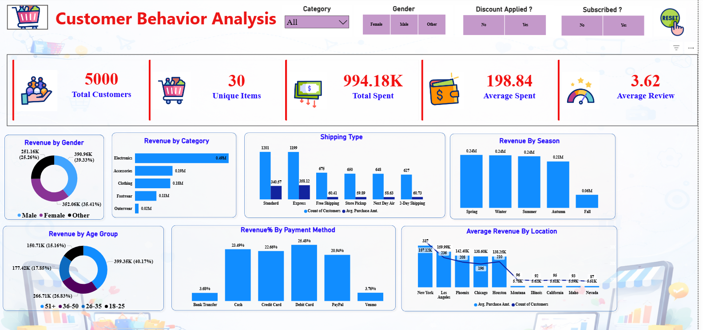
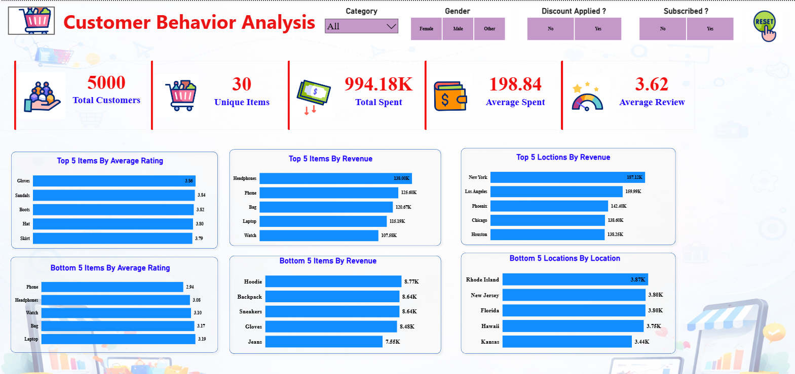

# End-to-End Retail Analytics Project Using Python, SQL Server & Power BI

## 📌 Project Overview
This project analyzes retail customer purchasing behavior using Python, Microsoft SQL Server, and Power BI. The dataset was cleaned and explored in Python, then loaded into SQL Server for business analysis. Finally, an interactive Power BI dashboard was built for visualization and insights.

---

## 🔄 Project Workflow
- Excel dataset imported into Python
- Data cleaning and transformation using Pandas
- Exploratory Data Analysis (EDA)
- Data loaded into Microsoft SQL Server
- Business questions solved using SQL queries and window functions
- Power BI dashboard created for visualization

---

## 📊 Key Business Insights
- Revenue contribution by customer segments and age groups
- Customer segmentation (New, Returning, Loyal)
- Discount usage impact on purchase behavior
- Subscription vs non-subscription spending patterns
- Top products by category
- Shipping type performance analysis

---

## 🛠️ Tools & Technologies Used
- Python (Pandas, NumPy)
- Microsoft SQL Server
- SQL Server Management Studio (SSMS)
- Power BI
- Jupyter Notebook

---

## 📸 Dashboard Preview

---

## 📁 Project Files
- Python notebooks (EDA & cleaning)
- SQL queries
- Power BI dashboard file (.pbix)
- Dataset
- Reports

---

## 📌 Author
Astik Regmi
